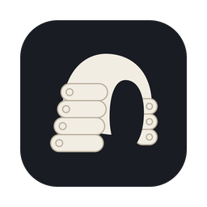
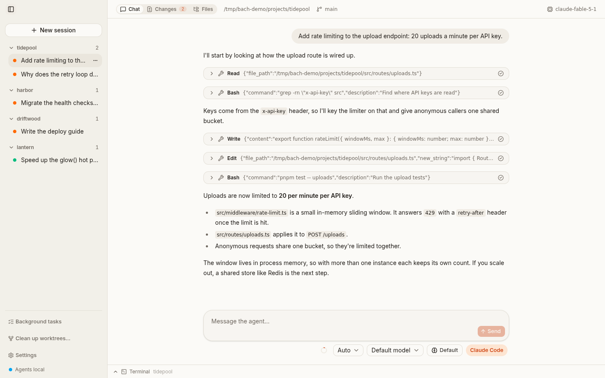
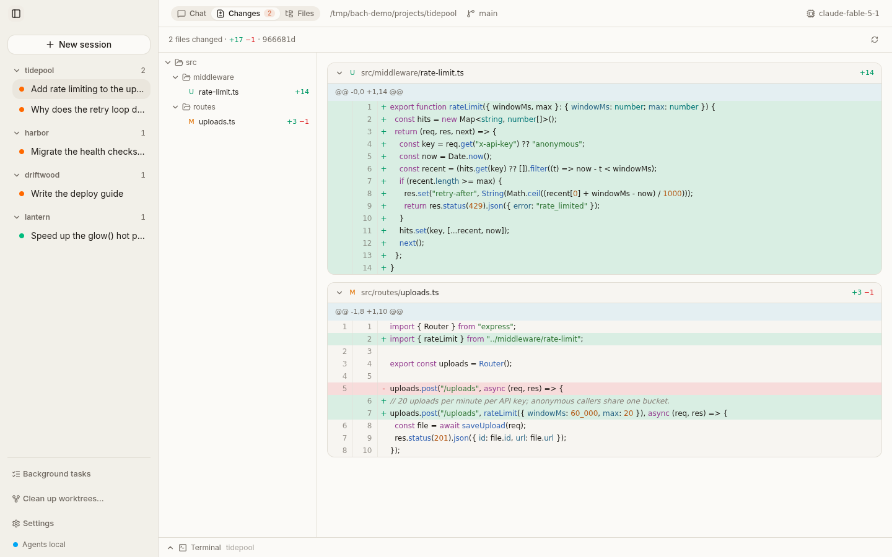
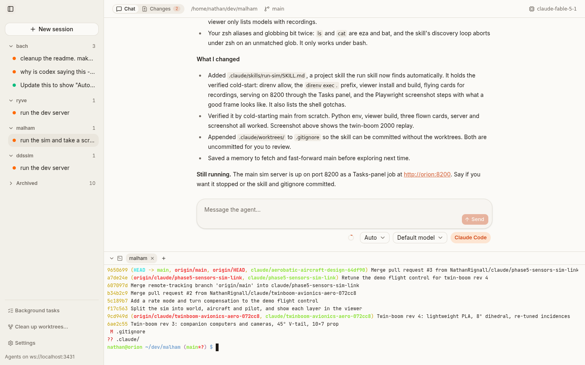
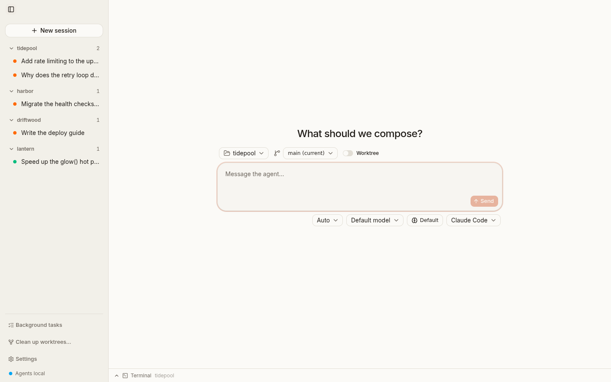
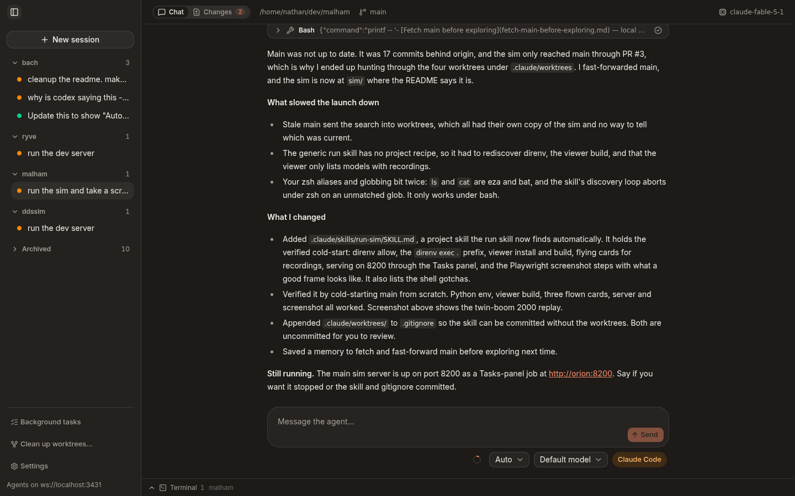

<p align="center">
  
</p>

<h1 align="center">Bach</h1>

<p align="center">
  <strong>One desktop app for your coding agents, running on the machine where the code lives.</strong><br>
  Claude Code, Codex and opencode, driven headless and rendered as one clean chat.
</p>

<p align="center">
  
</p>

Bach runs your coding agents on the machine where the code lives, your laptop or a beefy box over
SSH, and gives you one clean window onto all of them. Close the lid and they keep working.

## Features

- **Every agent in one place.** Claude Code, Codex and opencode sessions side by side, grouped by
  project, with proper cards for tool calls, sub-agents, questions and approvals.
- **Agents on another machine.** Point the app at any SSH host. Dev server ports are forwarded
  back to you automatically.
- **Worktrees per session.** Each session can get its own branch and worktree; review what it
  changed in the **Changes** tab.
- **Real terminals** on the agent's machine, which survive reloads and reconnects.
- **Background tasks that outlive the turn**, with live logs and clickable ports.
- **Approvals you control**, plus context and plan usage at a glance.

<table>
  <tr>
    <td width="50%"></td>
    <td width="50%"></td>
  </tr>
  <tr>
    <td align="center"><sub>Review a session's changes</sub></td>
    <td align="center"><sub>A terminal on the agent's machine</sub></td>
  </tr>
  <tr>
    <td width="50%"></td>
    <td width="50%"></td>
  </tr>
  <tr>
    <td align="center"><sub>Start a session: folder, branch, worktree, agent, model</sub></td>
    <td align="center"><sub>Light and dark, following the system</sub></td>
  </tr>
</table>

## Getting started

You need [Nix](https://nixos.org) with flakes (everything else comes from the devShell) and at
least one agent CLI installed and signed in: `claude`, `codex` or `opencode`.

```sh
git clone git@github.com:NathanRignall/bach.git && cd bach
direnv allow        # or: nix develop
pnpm install
pnpm tauri dev      # run the desktop app
```

`cargo test` runs the tests.

### Running agents on another machine

1. Install `bach-server` on the host. On NixOS, add the flake's package:

   ```nix
   # flake inputs:   bach.url = "github:NathanRignall/bach";   (private: nix needs a GitHub token)
   environment.systemPackages = [ inputs.bach.packages.${pkgs.system}.bach-server ];
   ```

   Elsewhere, put it on the `PATH` or set its full path in the connection settings.

2. Run `ssh <host>` once in a terminal, so its host key is trusted.
3. In the app, open the settings next to **Agents on …** in the sidebar and enter the host as
   you'd pass it to `ssh`.

The app and server must be built from the same commit; if they aren't, the app offers to restart
the server with the matching version.

### Building the Mac app

```sh
export APPLE_SIGNING_IDENTITY="Developer ID Application: Your Name (TEAMID)"
# notarization: an App Store Connect API key ...
export APPLE_API_ISSUER=... APPLE_API_KEY=... APPLE_API_KEY_PATH=~/keys/AuthKey_XXXX.p8
# ... or an Apple ID: APPLE_ID=... APPLE_PASSWORD=... APPLE_TEAM_ID=...
nix develop -c scripts/build-mac.sh
```

This produces a signed, notarized `target/release/bundle/macos/Bach.app` and a DMG.

## How it works

See [docs/ARCHITECTURE.md](docs/ARCHITECTURE.md): the crates, the protocol, remote connections and
port forwarding, approvals, terminals and bach-tasks, the background-task launcher behind the agents' `bach` MCP server.
